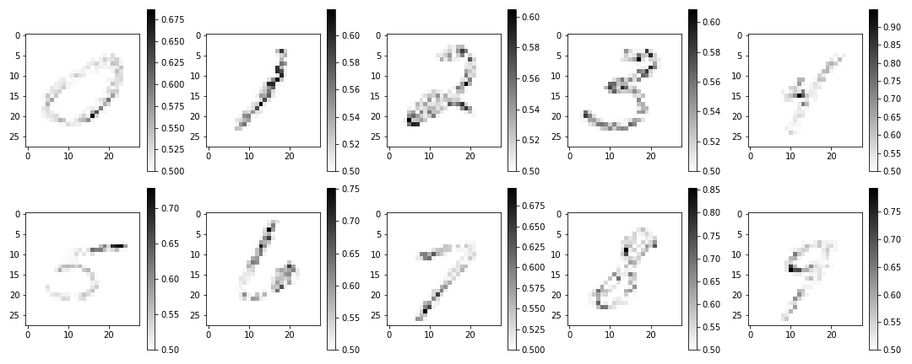

# Axiomatic Attribution for Deep Networks
An implementation of the Axiomatic attribution for deep networks is included in the Jupyter Notebook. [Paper link](https://arxiv.org/abs/1703.01365)

The paper's main idea is to identify those pixels in the input with a higher deviation in the output estimated by the backpropagation of the out node in the input. An example of the most relevant pixels for the MNIST data set in a CNN model computed by using the attached code is the following:

