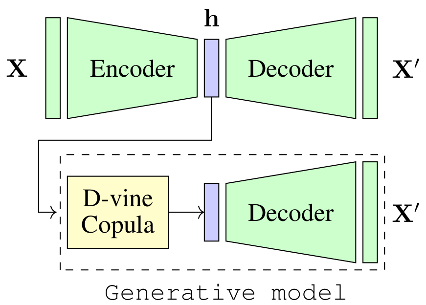
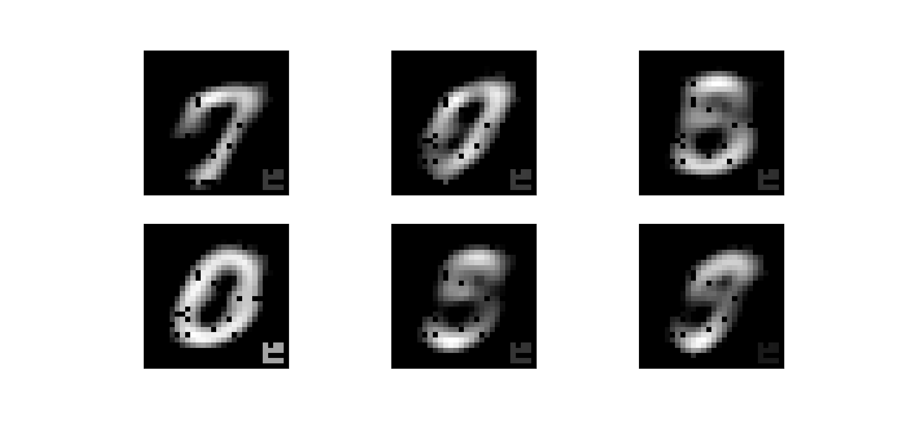

# Tracking Evidence of Backdoor Attacks in Latent Space Using Vine Copula Generative Model

The input space complexity determines the model's capabilities to extract their knowledge and translate the space of attributes into a function which is assumed in general, as a concatenation of non-linear functions between layers. In the presence of backdoor attacks, the space complexity changes, and induces similarities between classes that directly affect the model's training. As a consequence, the model tends to overfit the input set. In this research, we suggest the D-vine Copula Auto-Encoder (VCAE) as a tool to estimate the latent space distribution under the presence of backdoor triggers. Since no assumptions are made on the distribution estimation, like in Variational Autoencoders (VAE). It is possible to observe the backdoor stamp in non-attacked categories randomly generated. We exhibit the differences between a clean model (baseline) and the attacked one (backdoor) in a pairwise representation of the distribution. The idea is to illustrate the dependency structure change in the input space induced by backdoor features. Finally, we quantify the entropy's changes and the Kullback–Leibler divergence between models. In our results, we found the entropy in the latent space increases by around 27\% due to the backdoor trigger added to the input. 

The suggested methodology is depicted in the following figure:

Initially, an Auto-Encoder (AE) is trained and the latent space h is used to estimate the joint distribution of the input by using the D-vine copula method. Then, the estimated distribution is used as a generative process to reproduce samples from the latent space. In the attached Jupyter Notebook, you can find the implemented code to run the following experiments:

1. Generative process for a clean data set (MNIST).
2. Generative process for a backdoor data set.
3. Distribution of the latent space for a backdoor model produced from a clean data set. In this case, the trigger pattern is produced by the distribution despite the data used was clean.
4. Analysis of pair marginals distributions from the clean and backdoor latent space to compare the changes in the space induced by backdoor triggers.
5. Entropy and KullbackLeibler divergence between clean and backdoor models.

Evidence of trigger pattern reproduced by the D-vine copula of a backdoor model constructed from clean data is the following:

