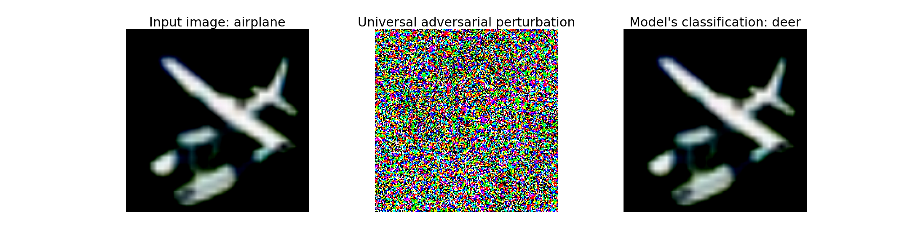

# PyTorch implementation of the Universal Adversarial Perturbation using a pre-trained VGG CIFAR-10 model 

In the Jupyter Notebook file, you can find an implementation of the **Universal adversarial perturbations (UAP)** suggested by Moosavi-Dezfooli et al. [paper link](https://openaccess.thecvf.com/content_cvpr_2017/html/Moosavi-Dezfooli_Universal_Adversarial_Perturbations_CVPR_2017_paper.html).

The original code, shared by authors, was implemented in an old version of `TensorFlow`, however, in the implementation presented here, the whole method was coded in `PyTorch 1.5.1` using a pre-trained VGG model with output dimensions: 1000 and fine-tuned to reduced dimensions of 10. Some comments about the paper's main idea and algorithm explanation are included in the file. 

Some results of a UAP added to one input image and the resulting misclassification produced by the model is the following:

