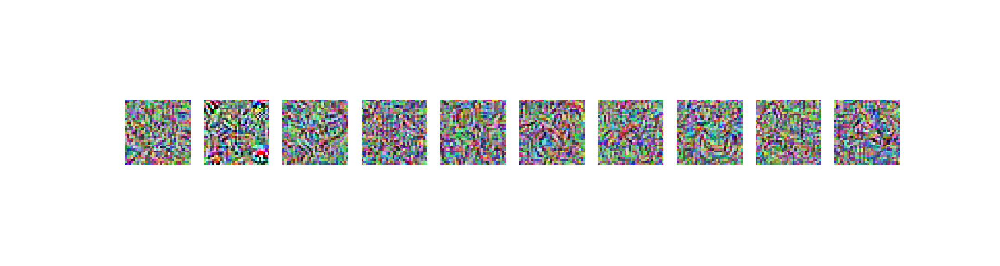

# Universal Litmus Patterns, Jupyter Notebook adaptation

In the Notebook file, we reviewed the ULP method to detect backdoor attacks in CNN models proposed by Kolouri et al. [paper link](https://openaccess.thecvf.com/content_CVPR_2020/html/Kolouri_Universal_Litmus_Patterns_Revealing_Backdoor_Attacks_in_CNNs_CVPR_2020_paper.html).

The original code shared by the authors is based on individual `.py` files. Therefore, in the file shared here, the most relevant ones to construct the classifier are adapted to be run in one file.

In the folder `results` you can find pre-trained ULP models we run locally for `N=1, 5, 10`. So, you can use those directly in step 3 of the Notebook shared here. The ULP model constructed was tested over six models shared by the authors. Obtained results are the following:

### Number of universal patterns (z) = 1. Pattern images:

   1. Model: Clean, ULP detection: Clean 0.241, Backdoor 0.759
   2. Model: Clean, ULP detection: Clean 0.010, Backdoor 0.990
   3. Model: Clean, ULP detection: Clean 0.997, Backdoor 0.003
   4. Model: Backdoor, ULP detection: Clean 0.586, Backdoor 0.414
   5. Model: Backdoor, ULP detection: Clean 0.116, Backdoor 0.884
   6. Model: Backdoor, ULP detection: Clean 0.999, Backdoor 0.001

### Number of universal patterns (z) = 5. Pattern images:

   1. Model: Clean, ULP detection: Clean 1.000, Backdoor 0.000
   2. Model: Clean, ULP detection: Clean 1.000, Backdoor 0.000
   3. Model: Clean, ULP detection: Clean 1.000, Backdoor 0.000
   4. Model: Backdoor, ULP detection: Clean 0.000, Backdoor 1.000
   5. Model: Backdoor, ULP detection: Clean 0.000, Backdoor 1.000
   6. Model: Backdoor, ULP detection: Clean 0.040, Backdoor 0.960

### Number of universal patterns (z) = 10. Pattern images:

   1. Model: Clean, ULP detection: Clean 1.000, Backdoor 0.000
   2. Model: Clean, ULP detection: Clean 1.000, Backdoor 0.000
   3. Model: Clean, ULP detection: Clean 1.000, Backdoor 0.000
   4. Model: Backdoor, ULP detection: Clean 0.000, Backdoor 1.000
   5. Model: Backdoor, ULP detection: Clean 0.000, Backdoor 1.000
   6. Model: Backdoor, ULP detection: Clean 0.000, Backdoor 1.000

